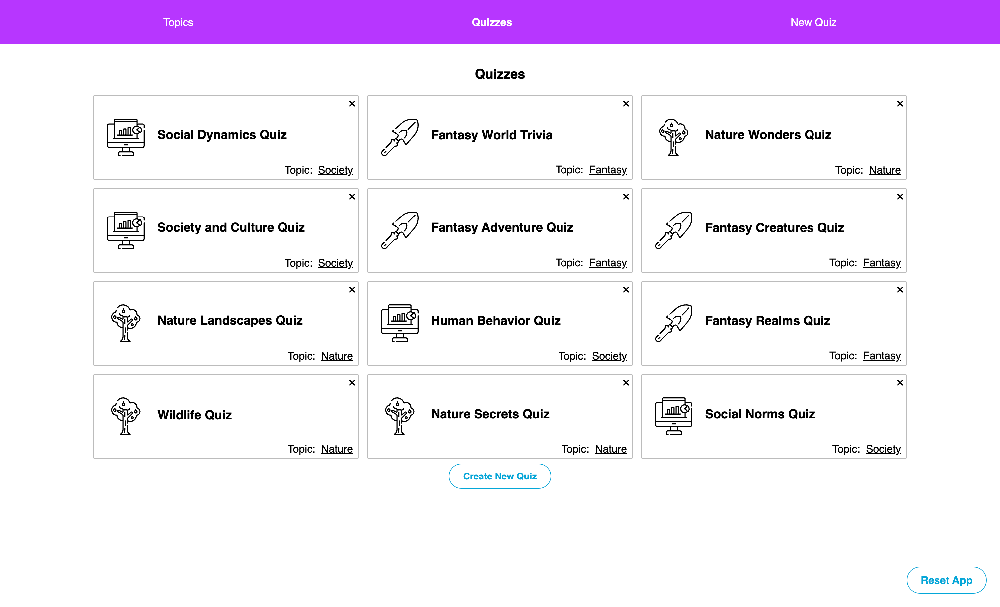

<a id="readme-top"></a>

[


# &nbsp; Flashcard Quiz Builder
<br />
<div align="center">
    
</div>
<br />


This project is a React-based web application I developed as part of **<a href="https://www.codecademy.com">Codecademy's</a>** Full Stack Engineering course. The application allows users to create quizzes with customizable flashcards, providing an interactive platform for learning and testing knowledge on various topics. Through this project, I enhanced my skills in React state management, React Redux, React Router, and user interface design. My focus was on creating a dynamic, intuitive experience where users can easily navigate through creating, managing, and taking quizzes, making learning both engaging and efficient.


**Link to live project:** <a href="/">...</a><br/>


<p align="right">(<a href="#readme-top">back to top</a>)</p>

## 📋 &nbsp; Table of Contents

1. [Project Overview](#project-overview)
2. [Features and Enhancements](#features)
3. [Installation](#installation)
4. [Technologies Used](#technologies-used)
5. [Contact](#contact)

<p align="right">(<a href="#readme-top">back to top</a>)</p>


## ✏️ &nbsp; <a id="project-overview">Project Overview</a>

The primary objective of this project was to create a React-based web application that enables users to create and manage quizzes with customizable flashcards. This involves building a user-friendly interface and functionality that allows users to create and organize quizzes and flashcards on various topics, making the learning process interactive and engaging.

<p align="right">(<a href="#readme-top">back to top</a>)</p>

## 💿 &nbsp; <a id="features">Features and Enhancements</a>

- **Topic Creation:** Provide a form for users to add new topics, including a name and an icon, allowing for easy organization of quizzes by category.
- **Quiz Creation:** Allow users to create new quizzes within selected topics, including naming the quiz and associating it with the relevant topic for better categorization.
- **Flashcard Management:** Enable users to add flashcards to quizzes, each with a question (front) and answer (back), making it easy to build comprehensive quizzes on various subjects.
- **Topic Sorting:** Allow users to view and sort quizzes by topic, providing an organized and streamlined way to access specific quizzes based on their interests.
- **Quiz List:** Display a list of quizzes within each topic, showing details such as the quiz name and associated flashcards, making navigation and selection straightforward.
- **Edit and Delete Quizzes:** Enable users to modify or remove quizzes, giving full control over the quiz content and structure.
- **Edit and Delete Flashcards:** Allow users to edit or delete individual flashcards within quizzes to keep the content up-to-date and relevant.
- **Local Storage:** Automatically save all topics, quizzes, and flashcards in the browser’s Local Storage, ensuring data persistence across sessions without the need for server-side storage.

<p align="right">(<a href="#readme-top">back to top</a>)</p>

## 🛠️ &nbsp; <a id="installation">Installation</a>

1. Clone the repo:
```bash
git clone ...
```

2. Install NPM packages:
```bash
npm install
```

3. Run the application:
```bash
npm start
```

<p align="right">(<a href="#readme-top">back to top</a>)</p>

## ⚙️ &nbsp; <a id="technologies-used">Technologies Used</a>

[![REACT][REACT.js]][REACT-url]
[![REDUX][REDUX.js]][REDUX-url]
[![REACT ROUTER][REACTROUTER.js]][REACTROUTER-url]
[![JAVASCRIPT][JAVASCRIPT.js]][JAVASCRIPT-url]
[![CSS][CSS.js]][CSS-url]
[![HTML5][HTML5.js]][HTML5-url]
[![GIT][GIT.js]][GIT-url]

<p align="right">(<a href="#readme-top">back to top</a>)</p>

## 👤 &nbsp; <a id="contact">Contact</a>

<a href="/">
  
</a>

[![LinkedIn][linkedin-shield]][linkedin-url] <br />
Jonathan Cano -  jonathancanofreta@gmail.com

<p align="right">(<a href="#readme-top">back to top</a>)</p>

[product-screenshot]: ./src/resources/img/screen2.png
[linkedin-shield]: https://img.shields.io/badge/-LinkedIn-blue.svg?style=for-the-badge&logo=linkedin&colorBlue
[linkedin-url]: https://www.linkedin.com/in/mericalkisla
[React.js]: https://img.shields.io/badge/React-20232A?style=for-the-badge&logo=react&logoColor=61DAFB
[React-url]: https://reactjs.org/
[Redux.js]: https://img.shields.io/badge/Redux-20232A?style=for-the-badge&logo=redux&logoColor=violet
[Redux-url]: https://redux.js.org/
[Reactrouter.js]: https://img.shields.io/badge/React%20router-20232A?style=for-the-badge&logo=reactrouter&logoColor=white
[Reactrouter-url]: https://reactrouter.com/
[Javascript.js]: https://img.shields.io/badge/Javascript-20232A?style=for-the-badge&logo=JavaScript&logoColor=Y
[Javascript-url]: https://developer.mozilla.org/es/docs/Web/JavaScript
[Jest.js]: https://img.shields.io/badge/Jest.js-20232A?style=for-the-badge&logo=jest&logoColor=orange
[Jest-url]: https://jestjs.io/
[CSS.js]: https://img.shields.io/badge/CSS3-20232A?style=for-the-badge&logo=css3&logoColor=306af1
[CSS-url]: https://developer.mozilla.org/es/docs/Web/CSS
[HTML5.js]: https://img.shields.io/badge/HTML5-20232A?style=for-the-badge&logo=html5&logoColor=e8571f
[HTML5-url]: https://developer.mozilla.org/es/docs/Glossary/HTML5
[Git.js]: https://img.shields.io/badge/git-20232A?style=for-the-badge&logo=git&logoColor=e8571f
[Git-url]: https://git-scm.com/
